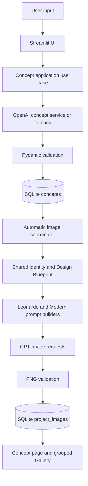

# Leonardo AI

Leonardo AI is an AI-powered idea and concept generation platform built with Python and Streamlit. It turns one user brief into a structured concept, a Renaissance-era engineering interpretation, a present-day implementation, six supporting concept images, and a persistent project portfolio.

The application accepts ideas across multiple categories—including robotics, energy, medicine, architecture, agriculture, transport, and creative product or service concepts. It is not limited to physical inventions, although the Leonardo Vision translates each idea into a concrete historically plausible apparatus for visual exploration.

```text
One idea
  → structured concept
  → Leonardo Vision
  → Modern Implementation
  → persistent project portfolio
```

Leonardo AI is currently a working MVP intended for concept exploration, demonstrations, education, and further product validation. It should not be treated as a fully production-ready engineering system.

## Current Features

- Configurable idea category, creativity mode, and target audience
- Free-form idea prompt, initial concept generation, and regeneration
- Pydantic validation and normalization before data reaches the UI
- Structured product, business, implementation, risk, and engineering analysis
- Leonardo Vision: a Renaissance-era reconstruction of the concept
- Modern Implementation: a present-day product or system interpretation
- Automatic generation of three Leonardo images and three Modern images
- Independent image validation and persistence for each generated image
- Persistent Previous Concepts history with open, favorite, and delete actions
- Gallery items grouped by concept, with separate Leonardo and Modern rows
- Manual Leonardo Sketch and Modern Blueprint generation workflows
- Saved-image favorites, deletion, and download for legacy manual images
- A4 PDF project-plan export generated in memory
- Browser-based voice prompt and voice assistant features where the Web Speech API is supported

The main UI is English. The voice assistant can synthesize selected summaries in English or Russian, but the application does not currently provide complete multilingual UI localization.

## Concept Output

Every accepted AI or fallback response is normalized into a stable UI-facing contract. The result includes:

- title, executive summary, problem statement, and target users;
- industries, use cases, components, materials, and technical requirements;
- Leonardo concept and sketch description;
- modern product definition and operating principle;
- prototype, MVP, pilot, and production implementation guides;
- deployment strategy, risks, constraints, and validation criteria;
- market-demand, startup-cost, ROI, and investor-oriented summaries;
- difficulty and development-time estimates.

If the OpenAI text request fails or returns an unsafe structure, the concept service produces and validates a prompt-aware fallback concept. The fallback is useful for continued exploration, but it does not establish market demand or technical feasibility.

## Automatic Image Generation

The automatic pipeline begins only after a concept has been validated and saved:

```text
Concept generation
  → concept validation
  → concept persistence
  → shared concept identity
  → internal Design Blueprint bundle
  → Leonardo and Modern prompt builders
  → six role-specific image requests
  → PNG validation
  → individual SQLite persistence
  → Concept page and Gallery rendering
```

The exact automatic image types are:

| Interpretation | Stored image types |
| --- | --- |
| Leonardo Vision | `leonardo_concept_1`, `leonardo_concept_2`, `leonardo_concept_3` |
| Modern Implementation | `modern_concept_1`, `modern_concept_2`, `modern_concept_3` |

The manual workflows remain distinct and use the legacy image types `leonardo` and `blueprint`.

### Image roles

The three Leonardo images represent:

1. A historical hero overview of the complete apparatus.
2. A mechanical-operation view showing cause and effect.
3. A historical human-use context.

The three Modern images represent:

1. A complete product or system overview.
2. Active operation with an observable result.
3. Real-world user interaction or deployment.

### Continuity and reliability

An internal Design Blueprint bundle defines one specific Leonardo machine and one related modern descendant. Each blueprint records appearance, proportions, structure, materials, mechanisms, input and output locations, power, controls, moving components, environment, and recognizable details. The blueprint is not displayed to the user; it is embedded before role-specific instructions so that camera position and activity can change without redesigning the machine between images.

Leonardo and Modern prompts preserve the same purpose and input-process-output lineage while applying different engineering constraints. Image requests use bounded concurrency with two workers. Each successful PNG is validated and committed independently, so one failed request does not delete the concept or other successful images. Session-state markers and database rechecks protect Streamlit reruns from requesting or saving duplicate slots.

## Leonardo Vision

Leonardo Vision is not a visual-style filter. It reconstructs the concept as if a High Renaissance engineer were attempting it around 1505 with historically plausible materials, manufacturing methods, mechanisms, power sources, and human operation.

Where a modern function would be impossible, the prompt builders translate it into an appropriate mechanical or human-assisted analogue. Depending on the function, this can involve gears, cams, belts, pulleys, counterweights, springs, clockwork, gravity, water or wind power, optical components, hydraulic effects, or trained operators. Modern electronics, plastics, digital interfaces, and contemporary robotics are explicitly excluded from the historical interpretation.

The output is a creative historical reconstruction, not a verified Leonardo da Vinci design or an engineering document from 1505.

## Modern Implementation

Modern Implementation is a present-day, commercially plausible descendant of the same concept. It uses contemporary materials, sensors, controls, actuators, safety measures, manufacturing practices, and service access when they support the concept.

The modern prompts prioritize buildability, maintainability, practical user workflows, and a credible operating environment. They avoid unsupported science-fiction styling such as impossible holograms, unexplained futuristic technology, excessive neon, and decorative robotics unrelated to the concept.

## Gallery and Persistence

Concepts and image assets are stored in SQLite. Each image row carries its existing `concept_id`, allowing the application to load only the images belonging to the selected concept.

The Gallery:

- loads automatic images from `project_images`;
- groups them into one expandable item per concept;
- preserves concept title, category, creation date, and favorite state;
- renders three Leonardo slots and three Modern slots in fixed order;
- leaves a missing slot in its correct position rather than shifting images;
- excludes automatic image types from the legacy image list to avoid duplicates.

Opening a saved concept validates its stored JSON and restores its saved images without starting a new generation run. Deleting a concept deletes its related images through the `ON DELETE CASCADE` foreign-key relationship. SQLite foreign keys are enabled for every application connection.

## PDF Export

The application creates an A4 project-plan PDF in memory with ReportLab and exposes it through a Streamlit download button. The current export includes the structured concept, Leonardo inspiration, modern product definition, business need, engineering details, roadmap, commercial outlook, and delivery metrics.

If manually generated and saved `leonardo` or `blueprint` images exist, the first image of each type can be included as a preview. The six automatic concept images are not currently embedded in the PDF.

## Architecture



The implemented layers are:

- `leonardo/app.py` — Streamlit entry point, startup initialization, and top-level application flow.
- `leonardo/pages/Gallery.py` — grouped concept-image Gallery and legacy saved-image presentation.
- `leonardo/ui/` — sidebar controls, session state, concept rendering, image presentation, reusable components, voice features, assets, formatting, and styles.
- `leonardo/application/` — use-case orchestration for concepts, images, and PDF export; this layer does not own Streamlit state.
- `leonardo/services/` — concept validation, fallback generation, and automatic image prompt/image services.
- `leonardo/ai_generator.py` — OpenAI text-generation request and JSON response parsing.
- `leonardo/database.py` — stable-path SQLite connections, schema initialization, queries, commits, favorites, and cascade deletion.
- `leonardo/pdf_export.py` — in-memory ReportLab PDF construction.
- `leonardo/tests/` — unit, integration, security, and regression coverage.

The dependency direction for the main workflows is broadly:

```text
app.py / pages → ui → application → services / database / pdf_export
```

## Technology Stack

| Area | Technology |
| --- | --- |
| Runtime | Python |
| Web UI | Streamlit |
| Text and image APIs | OpenAI Python SDK |
| Text model | `gpt-4o-mini` |
| Automatic image model | `gpt-image-2` |
| Manual image model | `gpt-image-1` |
| Validation | Pydantic |
| Persistence | SQLite via Python `sqlite3` |
| PDF generation | ReportLab |
| Tests | pytest |

Dependencies are listed without version pins in `leonardo/requirements.txt`; an installed development version should not be treated as a permanent project requirement.

## Installation

### 1. Clone the repository

```bash
git clone https://github.com/luenkolab/leonardo-ai.git
cd leonardo-ai/leonardo
```

### 2. Create and activate a virtual environment

macOS or Linux:

```bash
python3 -m venv venv
source venv/bin/activate
```

Windows PowerShell:

```powershell
py -m venv venv
venv\Scripts\Activate.ps1
```

### 3. Install dependencies

```bash
python -m pip install --upgrade pip
python -m pip install -r requirements.txt
```

### 4. Configure OpenAI access

The application reads one environment variable:

```text
OPENAI_API_KEY
```

The project does not load `.env` files itself. Export the key in the shell before starting Streamlit:

```bash
export OPENAI_API_KEY="your-api-key"
```

Windows PowerShell:

```powershell
$env:OPENAI_API_KEY="your-api-key"
```

Do not commit API keys. The repository ignores `.env`, but using a `.env` file would require an external loader or shell tooling because `python-dotenv` is not part of the application.

### 5. Run the application

```bash
python -m streamlit run app.py
```

On startup, `database.init_db()` creates or updates the local `leonardo.db` schema next to `database.py`. Database files are ignored by Git. Existing databases are reused; normal startup does not require a separate migration command.

The complete AI and image workflow requires an OpenAI account with API billing and access to the configured models. Without `OPENAI_API_KEY`, structured fallback concept generation remains available, but OpenAI text generation and image generation do not.

## Database

The SQLite schema contains two persistent entities:

- `concepts` stores the title, category, original prompt, normalized concept JSON, creation timestamp, and concept favorite state.
- `project_images` stores the associated `concept_id`, image type, generation prompt, image bytes, creation timestamp, and image favorite state.

`project_images.concept_id` references `concepts.id` with `ON DELETE CASCADE`. The database uses an absolute path derived from `database.py`, so launching Streamlit from a different working directory does not select a different database.

## Usage

1. Select an idea category.
2. Choose Classic, Bold, or Experimental creativity.
3. Select the target audience.
4. Enter a free-form idea or problem statement.
5. Select **Generate Idea**.
6. Review the validated structured concept.
7. Compare Leonardo Vision with Modern Implementation while the six images complete.
8. Use **Previous Concepts** to reopen, favorite, or delete saved work.
9. Open **Gallery** to browse concept-grouped automatic images and legacy manual images.
10. Optionally generate and save a separate Leonardo Sketch or Modern Blueprint, or export the project plan as PDF.

Six-image generation can take noticeable time because requests are processed with controlled concurrency rather than all at once. Completed images are retained even if another slot fails.

## Testing

From the `leonardo/` application directory:

```bash
python -m pytest -q
```

The regression suite covers, among other areas:

- concept validation, normalization, fallback behavior, and stored-concept loading;
- automatic image type mapping and generation triggering;
- Design Blueprint construction and continuity injection;
- bounded retries, PNG validation, partial failures, and successful-image persistence;
- Streamlit rerun duplicate protection and legacy workflow isolation;
- Gallery grouping, concept isolation, favorites, cascade deletion, and sidebar navigation;
- in-memory PDF export and temporary-resource safety;
- browser voice JavaScript escaping and database tracking safeguards.

Tests block unintended network connections; no real OpenAI request is required for the regression suite.

## Project Structure

```text
leonardo-ai/
├── README.md
└── leonardo/
    ├── app.py
    ├── ai_generator.py
    ├── config.py
    ├── database.py
    ├── pdf_export.py
    ├── requirements.txt
    ├── application/
    │   ├── concepts.py
    │   ├── images.py
    │   └── project_export.py
    ├── services/
    │   ├── ai_service.py
    │   ├── concept_schema.py
    │   ├── concept_service.py
    │   ├── fallback_service.py
    │   └── image_service.py
    ├── ui/
    │   ├── components.py
    │   ├── concept_page.py
    │   ├── home.py
    │   ├── images.py
    │   ├── sidebar.py
    │   ├── state.py
    │   ├── styles.py
    │   └── voice.py
    ├── pages/
    │   └── Gallery.py
    └── tests/
```

Local databases, virtual environments, caches, and generated runtime artifacts are intentionally omitted from this tree.

## Limitations

- Separate image requests can still introduce minor visual variation despite the shared Design Blueprint.
- Image generation requires OpenAI API access, billing, and eligibility for the configured model.
- Complex text and image generation can take noticeable time.
- Generated concepts, cost estimates, market claims, and visuals require human evaluation.
- Leonardo reconstructions are creative interpretations, not verified historical engineering documents.
- Generated output is not a substitute for technical, safety, legal, medical, regulatory, or patent review.
